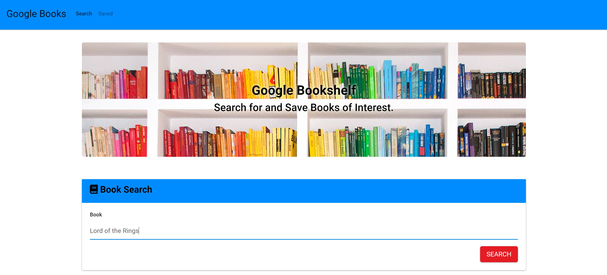
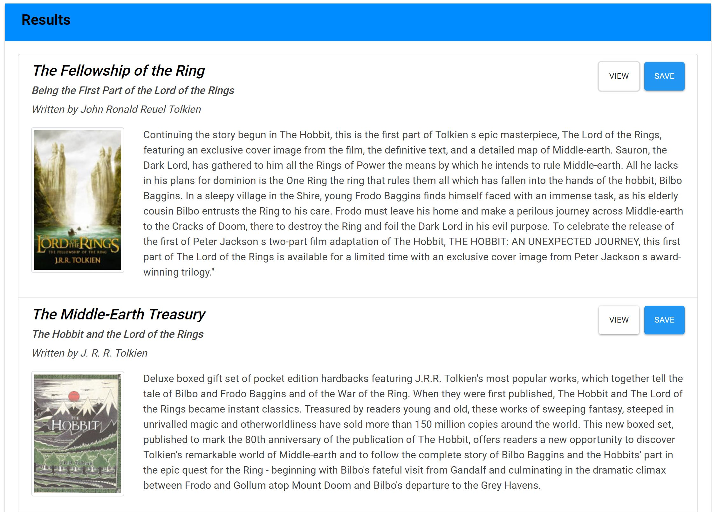
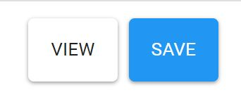
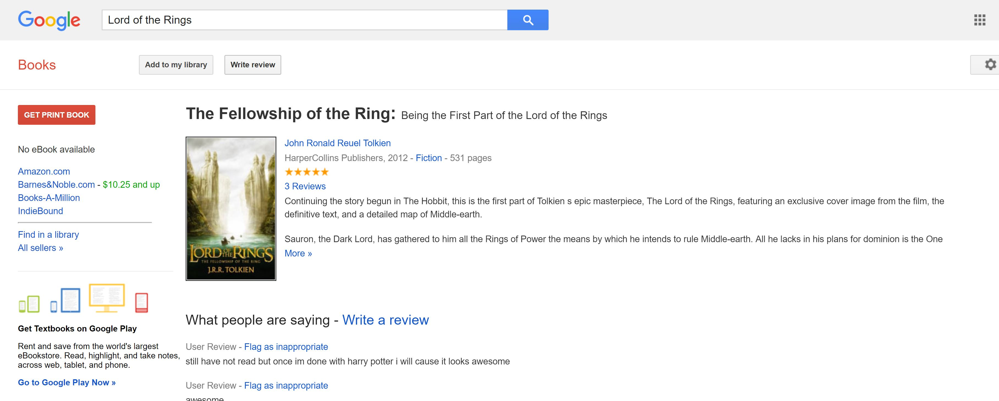

# **Google Bookshelf**

### This app is used to search and store books of interest. You are able to search Google's books API for any books you are interested. The result you will recieve information about the books. You can then save any of the results to a local MongoDB databse. One use this app can be used for is to curate a list of books to read. A user would search for titles they want to read and save them to the saved tab of the site. Once the user had read the book they can remove it from their saved section.

## How To use the Google Bookshelf

* User should type a name of a title they wish to search in the Book Search section

* They will then see in the results section 10 titles that match their query.

* If the user sees a book they wish to save they can click the Save button and it will be logged to their saved page.

* If the user wants more information than is provided they can click the view button to bring them to Google Books page on that title.

* If the user wants to view the books they have saved they have to navigate to the saved tab by clicking Saved on the Navbar

* On the saved tab of the site the user will see all the books they have saved. 

* If the user wants to remove a book they can do so by pressing the delete button.

## Please Enjoy the site!

